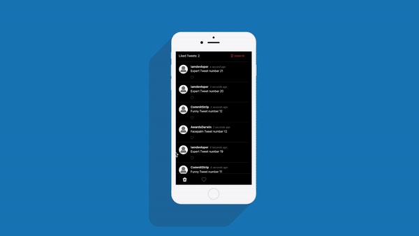

  

  
  
  
  
  

## What does it do
This project is part of a front-end challenge. 
The core function is to list values sent by an Observable as a Twitter-like structure/style and manage them, such as like/dislike them, list liked tweets, and delete them. You can check the full description of the challenge in [this pdf](./src/assests/pdf/Twitter-like_application.pdf).

## Table of contents

- [Overview](#what-does-it-do)
  - [Demo](#demo)
  - [Features](#features)
  - [Technology and resources](#technology-and-resources)
  - [Style Guide](#style-guide)
- [Setup process](#fast-setup)
  - [Local setup with Node](#local-setup-with-node)
  - [Running with Docker](#running-with-docker)
  - [Running Tests](#running-tests)
- [Development process explained](docs/PROCESS.md)

## Demo

## Features

- [✓] User friendly
- [✓] Mobile First
- [✓] Twitter-like structure/style 
- [✓] List Tweets by date descending
- [✓] Removes Tweets older than 30 seconds
- [✓] Like/Dislike animation
- [✓] Liked Tweets counter above each list
- [✓] Toggle between All Tweets and Liked Tweets list
- [✓] "Delete all" function for each list
- [✓] Test coverage
- [✓] "Dockerized"
- [✓] App up and running on [AWS Amplify Dev env](https://dev.d2k3vgnljt4tx7.amplifyapp.com/) 🚀
- [✓] App up and running on [AWS Amplify Prod env](https://main.d2k3vgnljt4tx7.amplifyapp.com/) 🚀

## Technology and resources
- React JS
- Redux
- RxJS
- SASS
- BEM

## Style Guide
I used a linter library (ESLint) with the Airbnb Style Guide, one of the most popular style guides available on Github, to guide the development through a set of best practices and guidelines for keeping the code quality.

## Local setup with Node

1. Download or Clone the project and extract it
2. Download [Node.js](https://nodejs.org/it/) (v 16) and install it.
3. Run `npm install` in the project's root folder
4. Start the app in the development mode via command line `npm start`
5. The project now is running on [http://localhost:3000](http://localhost:3000)

## Running with Docker

1. You should first have[ docker and docker-compose](https://docs.docker.com/get-docker/) in your machine
2. Run `docker-compose up -d --build` in the project's root folder
3. The project now is running on [http://localhost:3001](http://localhost:3001)
4. To stop the docker container just run `docker-compose stop` in your terminal

## Running Tests
#### To run simplified preview tests:

1.  Run `npm run test` in the project's root folder

#### To run tests seeing their respective descriptions:

1.  Run `npm run test-verbose` in the project's root folder

To check the development process explained [click here](docs/PROCESS.md)!
  
    
