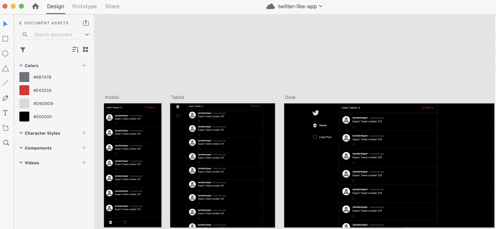
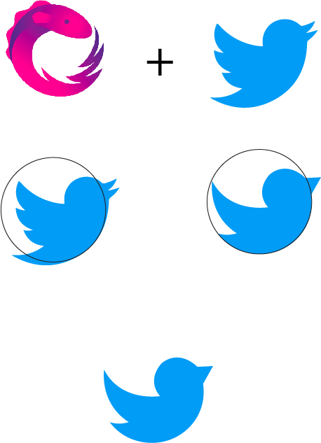
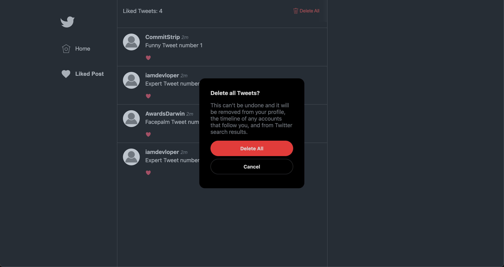
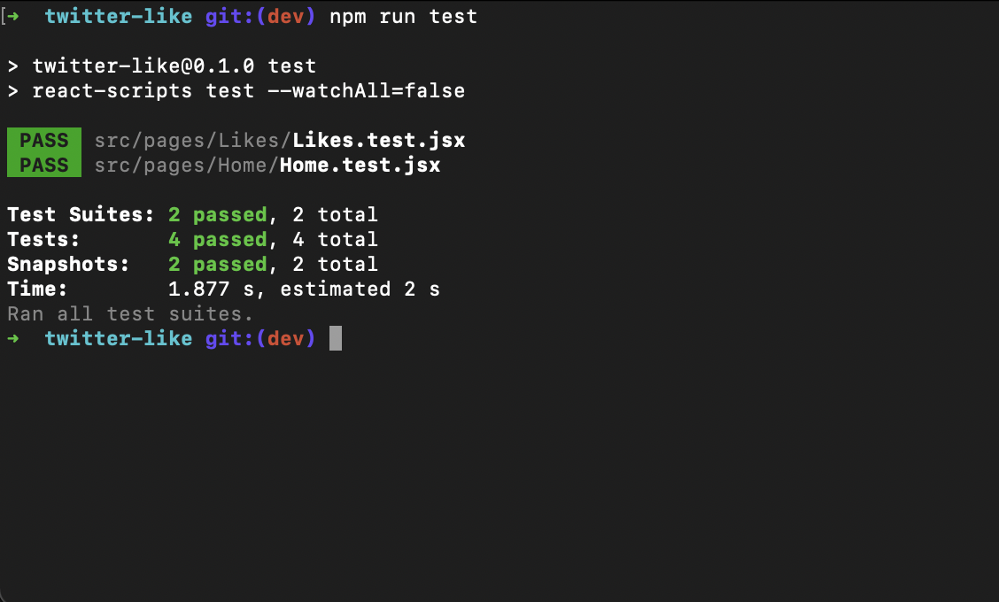
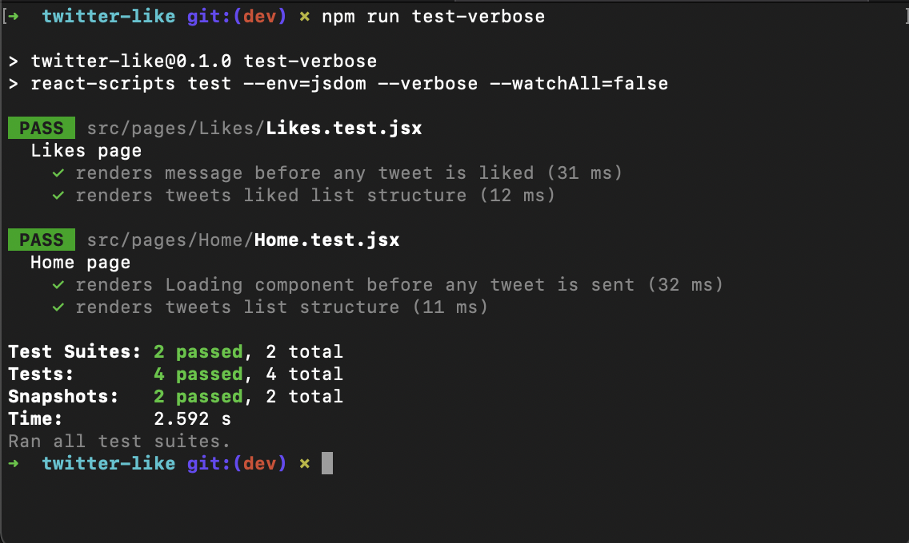

#### Return to the main README

- [Back to the project setup](../README.md)
  
## First Step
### UI Design
  Aiming to code a user-friendly UI and as similar as possible to the Twitter interface, I built a UI project in the beginning, starting with a wireframe (pen and paper ideas) and then creating the template with adobe XD (a design and prototype tool). With the UI project done I had the base colors, resources, spacing, responsiveness, and the whole idea to move to the coding process. 

<div align="center">
  <figure>
    
    <figcaption>Fig. 1 - Screenshot of UI Design process in Adobe XD.</figcaption>
  </figure>
</div>
<br />


  ### Logo rebranding
   To have some fun and be a bit creative, I decided to rebrand the Twitter logo to connect with the ReactiveX logo but kept the Twitter minimalist style. In the picture below, you can understand the concept behind the new logo.

  <div align="center">
    <figure>
      
      <br />
      <figcaption>Fig. 2 - The process of rebranding the twitter logo.</figcaption>
    </figure>
  </div>
<br />

  ## Second step

  ### Project definition
  Using the [challenge pdf](../src/assests/pdf/Twitter-like_application.pdf) description as a base and testing the actual Twitter application, I made some decisions about the application's behavior and flow.
  - I decided that I would treat the "All Tweets List" and "Liked Tweets List" separately to keep the "Liked Tweets List" as a history (similar to actual Twitter). That means they would be available even after 30 seconds, but that won't happen for the "All Tweets List", since they are updated with frequency and removed after 30 seconds.

  - This decision also reflects on the liked tweets counter. The counter of "Liked Tweets List" would update if you like or dislike a post. But for, the "All Tweets List" the counter would also update after the old post is removed from the list if you previously liked it. Since it's not there anymore, I understand that can't be counted as liked. 
  
  - Thinking about the "Delete all" function, since it is a good practice and such a typical flow for the actions that the user can't undo, I decided that the application should have a confirmation modal, asking if the user wants to proceed with the deletion. 

  <div align="center">
    <figure>
      
      <br />
      <figcaption>Fig. 3 - Example of the modal result.</figcaption>
    </figure>
  </div>

<br />
  
  ### Project setup
  I decided to group the files by file type to organize their structure. It is a common way to structure projects and pretty understandable since we have the components inside the components folder, pages inside the pages folder, and so go on, but of course, avoiding deep directory nesting.

      src/
        components/
          Menu/
          Modal/
          Tweet/
          ...
        pages/
          Home/
          Likes/
        ...

  As some components like `TopBar` and `Menu` they should be rendered on all pages, I created a component called `UIShell` that it is exported as a withRouter component to be on the top of the routes, receiving them as `children` props, and acting as a template for the application. 

  A shell is a collection of components shared by all products within a platform. 
  And the UIShell component is the template and the foundation for navigating and orienting the user to the UI.

    src/
      template/
        UIShell/
      ...

  To keep the Observable emitting value without re-rendering is subscribed inside  the UIShell component.
  To keep it organized, I created the `services` folder to export the creation of the observable and the subscription function from there. 

      src/
        services/
          tweetsService.js

  ### Test
  Testing a Front-end application is essential. It aims to test functionalities and verify that a website or app’s presentation layer is bug or error-free. After every update, this has to be done to ensure recent changes have not degraded any aspect of the UI.

  To demonstrate, I selected the two core components of the application, the Home page, which lists tweets, and the Likes page, which lists the liked tweets.

  The test created certifies that without data, the main component will render showing some loading component or message to the user and also certifies that the component renders the tweets list correctly when receiving the data.

  To run the test you just need to run the following command:
  `npm run test`


<div align="center">
  <figure>
    
    <br />
    <figcaption>Fig. 4 - Tests running on terminal.</figcaption>
  </figure>
</div>

<br />
  
  To run the test seeing their respective description you just need to run the following command: `npm run test-verbose`


<div align="center">
  <figure>
    
    <br />
    <figcaption>Fig. 5 - Tests running on terminal with verbose flag.</figcaption>
  </figure>
</div>

<br />

  ### Build and Deploy
  
  To deploy the application, two AWS applications enviroments were created. 
  One for the `dev` branch, with the purpose of testing the application befor deploy it on "Production".

  The oder was created for the `main` branch, representing the "Production" enviroment. 

  The pipeline is connected to the GitHub repostiry and starts automatically when the branch receives changes. 

  Aiming to deploy only if the tests built are passing, I set the amplify.yml with the configuration to run the tests in the preBuild step. 

```yml
      # amplify.yml

      version: 1
      frontend:
        phases:
          preBuild:
            commands:
              - npm ci && npm run test
          build:
            commands:
              - npm run build
        artifacts:
          baseDirectory: build
          files:
            - '**/*'
        cache:
          paths:
            - node_modules/**/*
  ```

#### Return to the main README

- [Back to the project setup](../README.md)
  

